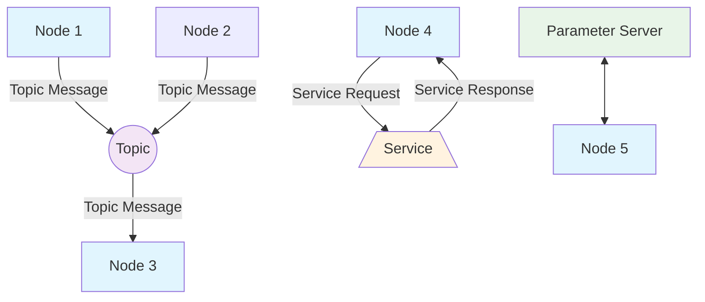

# ROS2 Basics

This module covers the fundamental concepts of ROS2 (Robot Operating System 2), including nodes, topics, services, and URDF (Unified Robot Description Format). These concepts form the foundation of robotic software architecture.

## Introduction to ROS2

ROS2 is the next generation of the Robot Operating System, designed to provide a flexible framework for writing robot software. It addresses limitations of ROS1 and provides improved features for real-world robotic applications.

### Key Improvements in ROS2

- **Real-Time Support**: Better support for real-time systems
- **Multi-Robot Support**: Enhanced capabilities for multi-robot systems
- **Security**: Built-in security features with DDS (Data Distribution Service)
- **Quality of Service (QoS)**: Configurable reliability and performance options

### ROS2 Architecture Overview



The diagram above illustrates the fundamental communication patterns in ROS2:
- **Publish-Subscribe**: Nodes communicate through topics (blue nodes)
- **Request-Response**: Nodes communicate through services (orange node)
- **Parameter Sharing**: Nodes share parameters through parameter server (green node)

## Nodes

A node is a process that performs computation. Nodes are the fundamental building blocks of a ROS2 system. In a distributed system, nodes can be distributed across multiple machines.

### Creating a Node in Python

```python
import rclpy
from rclpy.node import Node
from std_msgs.msg import String

class MinimalPublisher(Node):

    def __init__(self):
        super().__init__('minimal_publisher')
        self.publisher_ = self.create_publisher(String, 'topic', 10)
        timer_period = 0.5  # seconds
        self.timer = self.create_timer(timer_period, self.timer_callback)
        self.i = 0

    def timer_callback(self):
        msg = String()
        msg.data = 'Hello World: %d' % self.i
        self.publisher_.publish(msg)
        self.get_logger().info('Publishing: "%s"' % msg.data)
        self.i += 1

def main(args=None):
    rclpy.init(args=args)
    minimal_publisher = MinimalPublisher()
    rclpy.spin(minimal_publisher)
    minimal_publisher.destroy_node()
    rclpy.shutdown()

if __name__ == '__main__':
    main()
```

### Node Lifecycle

ROS2 nodes have a well-defined lifecycle that includes several states:

- **Unconfigured**: Initial state after node creation
- **Inactive**: After node configuration
- **Active**: Node is executing normally
- **Finalized**: Node is shutting down

The lifecycle manager allows for coordinated state transitions across multiple nodes, ensuring proper startup and shutdown sequences in complex robotic systems.

## Topics

Topics enable asynchronous communication between nodes using a publish-subscribe pattern. Publishers send messages to topics, and subscribers receive messages from topics.

### Publisher Example

```python
import rclpy
from rclpy.node import Node
from std_msgs.msg import String

class MinimalPublisher(Node):

    def __init__(self):
        super().__init__('minimal_publisher')
        self.publisher_ = self.create_publisher(String, 'topic', 10)
        timer_period = 0.5  # seconds
        self.timer = self.create_timer(timer_period, self.timer_callback)
        self.i = 0

    def timer_callback(self):
        msg = String()
        msg.data = 'Hello World: %d' % self.i
        self.publisher_.publish(msg)
        self.get_logger().info('Publishing: "%s"' % msg.data)
        self.i += 1
```

### Subscriber Example

```python
import rclpy
from rclpy.node import Node
from std_msgs.msg import String

class MinimalSubscriber(Node):

    def __init__(self):
        super().__init__('minimal_subscriber')
        self.subscription = self.create_subscription(
            String,
            'topic',
            self.listener_callback,
            10)
        self.subscription  # prevent unused variable warning

    def listener_callback(self, msg):
        self.get_logger().info('I heard: "%s"' % msg.data)

def main(args=None):
    rclpy.init(args=args)
    minimal_subscriber = MinimalSubscriber()
    rclpy.spin(minimal_subscriber)
    minimal_subscriber.destroy_node()
    rclpy.shutdown()

if __name__ == '__main__':
    main()
```

## Services

Services provide synchronous request-response communication between nodes. A service client sends a request and waits for a response from a service server. This is ideal for operations that require a direct response, such as configuration changes or data queries.

### Service Server Example

```python
from example_interfaces.srv import AddTwoInts
import rclpy
from rclpy.node import Node

class MinimalService(Node):

    def __init__(self):
        super().__init__('minimal_service')
        self.srv = self.create_service(AddTwoInts, 'add_two_ints', self.add_two_ints_callback)

    def add_two_ints_callback(self, request, response):
        response.sum = request.a + request.b
        self.get_logger().info('Incoming request\na: %d b: %d' % (request.a, request.b))
        return response

def main(args=None):
    rclpy.init(args=args)
    minimal_service = MinimalService()
    rclpy.spin(minimal_service)
    minimal_service.destroy_node()
    rclpy.shutdown()

if __name__ == '__main__':
    main()
```

### Service Client Example

```python
from example_interfaces.srv import AddTwoInts
import rclpy
from rclpy.node import Node

class MinimalClientAsync(Node):

    def __init__(self):
        super().__init__('minimal_client_async')
        self.cli = self.create_client(AddTwoInts, 'add_two_ints')
        while not self.cli.wait_for_service(timeout_sec=1.0):
            self.get_logger().info('service not available, waiting again...')
        self.req = AddTwoInts.Request()

    def send_request(self, a, b):
        self.req.a = a
        self.req.b = b
        self.future = self.cli.call_async(self.req)
        rclpy.spin_until_future_complete(self, self.future)
        return self.future.result()

def main(args=None):
    rclpy.init(args=args)
    minimal_client = MinimalClientAsync()
    response = minimal_client.send_request(1, 2)
    minimal_client.get_logger().info(
        'Result of add_two_ints: for %d + %d = %d' %
        (1, 2, response.sum))
    minimal_client.destroy_node()
    rclpy.shutdown()

if __name__ == '__main__':
    main()
```

### When to Use Services vs Topics

- **Use Topics (Publish/Subscribe)** for continuous data streams like sensor data, robot state, or logging
- **Use Services** for discrete operations like configuration changes, triggering actions, or requesting specific data
- **Consider Actions** for long-running operations that may provide feedback during execution

## URDF (Unified Robot Description Format)

URDF is an XML format used to describe robot models in ROS. It defines the physical and visual properties of a robot, including links, joints, and materials.

### Basic URDF Example

```xml
<?xml version="1.0"?>
<robot name="simple_robot">
  <!-- Base link -->
  <link name="base_link">
    <visual>
      <geometry>
        <cylinder length="0.6" radius="0.2"/>
      </geometry>
      <material name="blue">
        <color rgba="0 0 0.8 1"/>
      </material>
    </visual>
  </link>

  <!-- First link -->
  <link name="first_link">
    <visual>
      <geometry>
        <box size="0.1 0.1 0.2"/>
      </geometry>
      <material name="red">
        <color rgba="0.8 0 0 1"/>
      </material>
    </visual>
  </link>

  <!-- Joint connecting the links -->
  <joint name="base_to_first" type="revolute">
    <parent link="base_link"/>
    <child link="first_link"/>
    <origin xyz="0 0 0.3" rpy="0 0 0"/>
    <axis xyz="0 0 1"/>
    <limit lower="-3.14" upper="3.14" effort="1000.0" velocity="0.5"/>
  </joint>
</robot>
```

## Practical Exercise

Create a simple ROS2 package with:
1. A publisher node that publishes messages to a custom topic
2. A subscriber node that listens to the topic and logs the messages
3. A URDF file that describes a simple robot with at least 2 links and 1 joint

### Exercise Steps:

1. **Create a new ROS2 package**:
   ```bash
   ros2 pkg create --build-type ament_python my_robot_pkg
   ```

2. **Implement the publisher node** in `my_robot_pkg/my_robot_pkg/publisher_node.py`

3. **Implement the subscriber node** in `my_robot_pkg/my_robot_pkg/subscriber_node.py`

4. **Create a URDF file** in `my_robot_pkg/urdf/simple_robot.urdf`

5. **Test your implementation** by running the publisher and subscriber nodes simultaneously

### Expected Learning Outcomes:

After completing this exercise, you should understand:
- How to create and structure a ROS2 package
- The publish-subscribe communication pattern
- Basic URDF syntax for robot modeling
- How to run multiple ROS2 nodes simultaneously