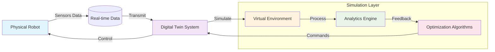

# Digital Twin Simulation

Digital twin technology creates virtual replicas of physical systems, allowing for testing, validation, and optimization without the risks and costs associated with real-world experimentation. In robotics, digital twins are essential for developing and validating robot behaviors before deployment.

## Introduction to Digital Twins in Robotics

A digital twin in robotics is a virtual representation of a physical robot or robotic system that mirrors its real-world counterpart in real-time. This technology enables:

- **Safe Testing**: Validate robot behaviors without physical hardware
- **Scenario Simulation**: Test robots in various environments and conditions
- **Performance Optimization**: Fine-tune algorithms before deployment
- **Failure Analysis**: Understand and prevent potential issues

### Digital Twin Architecture



The diagram above shows the bidirectional flow between the physical robot and its digital twin:
- **Data Flow**: Sensors from the physical robot feed data to the digital twin
- **Simulation**: The digital twin processes data in a virtual environment
- **Analysis**: Analytics engines process the simulation data
- **Optimization**: Algorithms optimize robot behavior
- **Control**: Optimized commands are sent back to the physical robot

## Gazebo Simulation Environment

Gazebo is a powerful 3D simulation environment that provides realistic physics simulation, high-quality graphics, and convenient programmatic interfaces. It's widely used in robotics research and development.

### Key Features of Gazebo

- **Physics Simulation**: Accurate modeling of rigid body dynamics, contact simulation, and sensors
- **Sensor Simulation**: Cameras, LiDAR, IMUs, GPS, and other sensor models
- **Plugin System**: Extensible architecture for custom sensors and controllers
- **ROS Integration**: Seamless integration with ROS and ROS2 for robot simulation

### Setting up a Robot in Gazebo

To simulate a robot in Gazebo, you typically need:

1. **URDF Model**: Your robot description file
2. **Gazebo Plugins**: To interface with the physics engine
3. **Launch Files**: To start both Gazebo and your robot controllers

Example Gazebo plugin for a differential drive robot:

```xml
<gazebo>
  <plugin name="differential_drive_controller" filename="libgazebo_ros_diff_drive.so">
    <ros>
      <namespace>/my_robot</namespace>
      <remapping>cmd_vel:=cmd_vel</remapping>
      <remapping>odom:=odom</remapping>
    </ros>
    <update_rate>30</update_rate>
    <left_joint>left_wheel_joint</left_joint>
    <right_joint>right_wheel_joint</right_joint>
    <wheel_separation>0.3</wheel_separation>
    <wheel_diameter>0.15</wheel_diameter>
    <max_wheel_torque>20</max_wheel_torque>
    <max_wheel_acceleration>1.0</max_wheel_acceleration>
    <command_topic>cmd_vel</command_topic>
    <odometry_topic>odom</odometry_topic>
    <odometry_frame>odom</odometry_frame>
    <robot_base_frame>base_link</robot_base_frame>
  </plugin>
</gazebo>
```

## Unity Physics Engines

Unity provides advanced physics simulation capabilities that are increasingly being used for robotics simulation. Unity's physics engine offers:

- **High-Fidelity Graphics**: Photorealistic rendering for computer vision tasks
- **Physics Simulation**: Realistic rigid body dynamics and collision detection
- **XR Support**: Virtual and augmented reality capabilities
- **C# Integration**: Direct access to Unity's API for custom simulation logic

### Unity Robotics Simulation Benefits

- **Visual Fidelity**: High-quality rendering for training perception systems
- **Flexible Environments**: Easy creation of diverse simulation scenarios
- **Multi-Sensor Simulation**: Support for cameras, LiDAR, and other sensors
- **Cloud Deployment**: Scalable simulation across multiple machines

## Physics Modeling Concepts

Accurate physics modeling is crucial for effective digital twin simulation. Key concepts include:

### Rigid Body Dynamics

Rigid body dynamics simulate the motion of solid objects that do not deform. Key parameters include:

- **Mass**: The amount of matter in the object
- **Inertia**: Resistance to rotational motion
- **Center of Mass**: Point where mass is concentrated
- **Collision Shapes**: Simplified geometry for collision detection

### Contact Simulation

Contact simulation handles interactions between objects:

- **Friction**: Resistance to sliding motion
- **Bounce**: Elasticity of collisions
- **Contact Stiffness**: How rigidly objects resist penetration

### Sensor Simulation

Simulated sensors provide virtual data streams:

- **Camera Sensors**: Generate visual data for computer vision
- **LiDAR**: Simulate 3D point cloud generation
- **IMU**: Simulate inertial measurement units
- **Force/Torque Sensors**: Simulate physical interaction forces

## Practical Exercise

Create a simulation environment with:
1. A simple robot model in URDF
2. Gazebo world with obstacles
3. Sensor simulation for navigation
4. Control interface for robot movement

### Exercise Steps:

1. **Create a simple robot URDF** with basic geometry
2. **Set up a Gazebo world** with walls and obstacles
3. **Add a differential drive plugin** to your robot
4. **Create a ROS2 node** to control the robot in simulation
5. **Implement basic navigation** to move the robot around obstacles